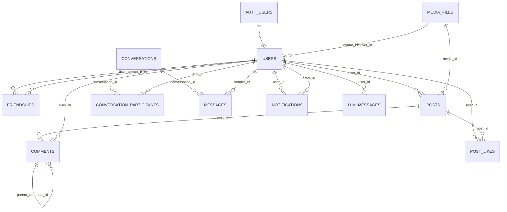

*This project has been created as part of the 42 curriculum by fitrandr, ttelolah, atovoman, hramaros, nrasamim.*

# peerloop: PeerLoop

## Description
**PeerLoop** is a microservices-based social platform deployed with Docker Compose. The running stack includes a React frontend, an Nginx reverse proxy with ModSecurity, an API Gateway, dedicated services for auth, users, files, friendships, posts, notifications, chat, search and LLM features, plus Vault, Prometheus, Grafana and n8n for automation workflows.

Beyond the technical stack, the goal of the project is to simulate an ongoing peer-to-peer social interaction loop between people. The platform is designed around the idea that users continuously connect, react, exchange, and re-engage with one another through conversations, content, and notifications. This is why we chose the name **PeerLoop**: it reflects an infinite loop of interaction between peers.

**Key features**
- Supabase-based authentication with Google OAuth, refresh cookies and TOTP 2FA
- User profiles, media upload, friendships, posts, comments, likes and notifications
- Realtime chat with WebSockets and presence tracking
- Search service for users
- Gemini-backed LLM assistant
- Centralized secrets via Vault
- Full metrics via Prometheus/Grafana
- n8n automation workflows (webhook-driven incident routing and alerting)

## Features List (with ownership)
- **Frontend** (React + Vite) — *nrasamim*, *atovoman*
  - Social UI, API integration and service access through the gateway.
- **API Gateway** (FastAPI) — *fitrandr*, *ttelolah*
  - Public entrypoint, auth propagation, health and metrics.
- **Core backend services** (FastAPI) — *fitrandr*, *ttelolah*
  - Auth, users, files, friendships, posts, notifications, chat and LLM flows.
- **Search Service** (FastAPI) — *fitrandr*, *hramaros*
  - Search on users and posts backed by Supabase reads.
- **Reverse Proxy + WAF** (Nginx + ModSecurity) — *hramaros*
  - TLS termination, routing, service proxying and internal exposure and security filtering.
- **Secrets Management** (Vault) — *hramaros*
  - Centralized secret loading for services.
- **Monitoring** (Prometheus + Grafana) — *hramaros*
  - Metrics scraping, dashboards and service observability.
- **Workflow Automation** (n8n) — *fitrandr*
  - Webhook-based operational workflows and integrations.
- **Docker Compose Orchestration** — *hramaros*, *fitrandr*
  - Multi-service startup, volumes, networking and runtime consistency.

## Architecture (high level)
```
Frontend (React + Vite)
    │
    ▼
Nginx + ModSecurity (TLS/WAF)
    │
    ▼
API Gateway (FastAPI) ─────► Prometheus ─────► Grafana
    │
    └──────────────────────► n8n (automation workflows)
    │
    ├──► auth_service
    ├──► users_service
    ├──► file_service
    ├──► friendship_service
    ├──► post_service
    ├──► notification_service
    ├──► chat_service
    ├──► search_service
    └──► llm_service

Vault provides secrets to backend services.
Supabase is the main application data source.
ImageKit stores uploaded files.
Gemini powers the LLM service.
```

## Backend Folder Structure
The backend is organized as one folder per service, with shared packages for common models and infrastructure helpers. Each service runs as its own container in `docker-compose.yml`.

### Common service layout
- `core/` runtime configuration, environment helpers, auth helpers
- `routers/` FastAPI route definitions
- `stores/` Supabase data access and persistence helpers
- `services/` business logic and workflows
- `schemas/` Pydantic request and response models
- `serializers/` response shaping helpers
- `utils/` small shared helpers
- `main.py` service entrypoint and metrics wiring

### Service directories
- `api-gateway/` public entrypoint and proxy routing
- `auth_service/` auth, OAuth, session, and 2FA flows
- `users-service/` profile read and update service
- `file_service/` media upload and metadata storage
- `friendship-service/` friendship requests and presence enrichment
- `post-service/` posts, comments, likes, and feeds
- `notification-service/` notification storage and state
- `chat-service/` conversations, messages, and WebSockets
- `search-service/` search API (module root under `search-service/app/`)
- `llm-service/` Gemini-backed chat and history

### Shared backend support
- `shared_schemas/` shared Pydantic models and Vault client
- `bd/` SQL schema and RLS policies
- `scripts/` operational scripts (for example, rate-limit tests)
- `nginx/`, `vault/`, `prometheus/`, `grafana/` infrastructure services around the backend

## Technical Stack
**Frontend**
- React 19 + Vite
- Chakra UI
- TypeScript
- Nginx for static hosting in Docker

**Backend**
- FastAPI across the gateway and business services
- Pydantic, Uvicorn, Prometheus client
- Supabase Python client for auth and data access

**Data & Integrations**
- Supabase/PostgreSQL as main source of truth
- ImageKit for media storage
- Google OAuth + TOTP for authentication flows
- Gemini API for AI chat features

**DevOps & Security**
- Docker + Docker Compose
- Nginx reverse proxy + ModSecurity WAF
- HashiCorp Vault for secrets
- n8n for workflow orchestration and webhook automation

**Observability**
- Prometheus for metrics
- Grafana for dashboards
- n8n for event-driven operational automations

## Database Schema
The versioned SQL schema lives in `bd/init.sql`. It defines the core application tables and RLS policies. The running Supabase instance can also include tables managed outside this repo, most notably `media_files` used for user and post media.

### Main application tables
- `users`
- `friendships`
- `posts`, `post_likes`, `comments`
- `notifications`
- `conversations`, `conversation_participants`, `messages`
- `llm_messages`

### External tables referenced at runtime
- `auth.users` (Supabase Auth) is the source of truth for identities.
- `media_files` is owned by the file service and referenced by `users.avatar_id`, `users.cover_id`, and `posts.media_id`.

### Relationships (summary)
- `auth.users.id` 1-1 `users.id` (sync trigger on signup)
- `users.id` 1-N `posts.user_id`, `comments.user_id`, `notifications.user_id`, `messages.sender_id`, `llm_messages.user_id`
- `users.id` N-N `users.id` via `friendships`
- `posts.id` 1-N `comments.post_id` and N-N `users.id` via `post_likes`
- `conversations.id` N-N `users.id` via `conversation_participants`

### Schema diagram


For full table definitions and RLS policies, see `bd/README.md`.

### Search Service Schema
The current runtime is exposed by `search-service/app/main.py`. It queries Supabase directly and exposes:
- `GET /`
- `GET /health`
- `GET /metrics`
- `GET /search/users`
- `GET /search/posts`

## Instructions
### Prerequisites
- Docker (Engine) + Docker Compose v2
- Make (optional but recommended)

### Setup
1) Create secrets file:
- Copy the templates and fill in real values:
  - `cp secrets.env.example secrets.env && cp .env.example .env && cp frontend/.env.example frontend/.env`

2) Start the full stack:
- With: `make up`

### Access Points
- Frontend: https://localhost:8443
- API Gateway: https://localhost:8444
- API docs: https://localhost:8444/docs
- Prometheus: https://localhost:8443/services/prometheus/
- Grafana: https://localhost:8443/services/grafana/
- Vault: https://localhost:8443/services/vault/
- n8n: https://localhost:8443/services/n8n/

### Health checks
- API Gateway: https://localhost:8444/health
- Auth Service: https://localhost:8443/services/auth_service/health
- Search Service: https://localhost:8443/services/search-service/health

### Useful commands
- `make logs` — follow logs
- `make logs-n8n` — n8n logs only
- `make status` — service status
- `make clean` — stop services and remove volumes
- `make rebuild` — recompile the entire stack from scratch

### Notes
- TLS is self-signed locally; use `curl -k` for HTTPS tests.
- Most backend services load secrets from Vault at startup.
- Vault is exposed with TLS and auto-seeded from `secrets.env`.
- The gateway is the intended public entrypoint for all business APIs.

## n8n Workflows (Professional Baseline)
- Included workflow files:
  - `n8n/workflows/professional_incident_triage.json`
  - `n8n/workflows/professional_daily_ops_report.json`
  - `n8n/workflows/professional_user_onboarding_automation.json`
  - `n8n/workflows/professional_user_onboarding_crm_support.json`
  - `n8n/workflows/professional_content_moderation_escalation.json`
  - `n8n/workflows/professional_failed_login_guard.json`
  - `n8n/workflows/professional_user_reactivation_campaign.json`
- Import from n8n UI: **Workflows** → **Import from File**
- Full workflow documentation and test playbook: `n8n/README.md`

### n8n Validation Quickstart (project-level)

If you want to quickly validate that automations are working end-to-end:

1. Start stack: `make up`
2. Open n8n: `https://localhost:8443/services/n8n/`
3. Run one webhook workflow manually (for example Incident Triage) from `n8n/README.md` test payloads.
4. Check results in n8n UI:
   - `Executions` tab
   - node `Input/Output/Error`
5. Validate technical evidence in logs:
```bash
docker compose logs --since=10m n8n nginx
```

Expected result:
- webhook accepted (not `webhook not registered`)
- execution visible with business output
- no blocking runtime errors

### If webhook returns "not registered"

In some n8n states, workflows can look active but production webhooks are not effectively published.
Apply this UI procedure workflow-by-workflow:

1. Open workflow
2. Make a minor non-functional change
3. Click **Save**
4. Toggle **Active** OFF then ON
5. Retest webhook

Detailed troubleshooting and proof checklist are documented in `n8n/README.md` sections:
- `12) Verification des resultats (preuve de fonctionnement)`
- `13) Publication UI forcee (cas "webhook not registered")`

### Workflow A: Incident triage and alerting
- Webhook endpoint after activation:
  - `POST https://localhost:8443/services/n8n/webhook/peers/incident-events`
- Required payload fields:
  - `source`, `eventType`, `severity`, `summary`
- Optional payload fields:
  - `details`, `metadata`, `occurredAt`, `correlationId`
- Severity routing:
  - `high` and `critical` route to escalation path (HTTP 202)
  - others route to standard path (HTTP 200)
- Optional alert channel:
  - set `N8N_ALERT_WEBHOOK_URL` (for example Slack Incoming Webhook URL)

Example payload:
```json
{
  "source": "api-gateway",
  "eventType": "rate_limit_spike",
  "severity": "high",
  "summary": "Burst of 429 responses detected on /api/auth/login",
  "details": "Threshold exceeded for 3 minutes",
  "metadata": {
    "service": "api-gateway",
    "region": "local-dev"
  }
}
```

### Workflow B: Daily ops health report + archive
- Trigger mode: daily cron (default 07:00)
- Health checks:
  - `api-gateway`, `auth_service`, `search_service`, `prometheus`
- Output behavior:
  - builds a consolidated daily report
  - optional report notification to `N8N_DAILY_REPORT_WEBHOOK_URL`
  - optional external archive push to `N8N_REPORT_ARCHIVE_WEBHOOK_URL`
  - sends degraded alert to `N8N_ALERT_WEBHOOK_URL` when failures are detected

### Workflow C: User onboarding automation
- Webhook endpoint after activation:
  - `POST https://localhost:8443/services/n8n/webhook/peers/user-onboarding`
- Required payload fields:
  - `userId`, `username`
- Optional payload fields:
  - `email`, `locale`, `registeredAt`, `correlationId`
- Optional actions:
  - in-app welcome notification via `N8N_ONBOARDING_NOTIFICATION_WEBHOOK_URL`
  - welcome email via `N8N_ONBOARDING_EMAIL_WEBHOOK_URL`

### Workflow D: User onboarding pro (CRM + support)
- Webhook endpoint after activation:
  - `POST https://localhost:8443/services/n8n/webhook/peers/user-onboarding-pro`
- Required payload fields:
  - `userId`, `username`
- Optional actions:
  - in-app welcome notification via `N8N_ONBOARDING_NOTIFICATION_WEBHOOK_URL`
  - welcome email via `N8N_ONBOARDING_EMAIL_WEBHOOK_URL`
  - CRM contact upsert via `N8N_ONBOARDING_CRM_WEBHOOK_URL`
  - support ticket creation via `N8N_ONBOARDING_SUPPORT_WEBHOOK_URL`
  - execution audit export via `N8N_ONBOARDING_AUDIT_WEBHOOK_URL`

### Workflow E: Content moderation escalation
- Webhook endpoint after activation:
  - `POST https://localhost:8443/services/n8n/webhook/peers/moderation-events`
- Required payload fields:
  - `reportId`, `contentType`, `contentId`, `reason`, `severity`
- Severity behavior:
  - `low`/`medium`: standard moderation routing
  - `high`: escalated moderation routing
  - `critical`: escalated routing + optional auto-action
- Optional actions:
  - team notification via `N8N_MODERATION_NOTIFICATION_WEBHOOK_URL`
  - moderation case creation via `N8N_MODERATION_CASE_WEBHOOK_URL`
  - auto-action endpoint via `N8N_MODERATION_ACTION_WEBHOOK_URL`

### Workflow F: Failed login guard and security escalation
- Webhook endpoint after activation:
  - `POST https://localhost:8443/services/n8n/webhook/peers/security/auth-events`
- Required payload fields:
  - `eventType`, `username`, `ipAddress`
- Supported eventType:
  - `failed_login`, `bruteforce_detected`, `account_locked`
- Behavior:
  - computes severity from event type and failed attempts
  - `high`/`critical` route to escalation flow (HTTP 202)
  - `low`/`medium` stay in standard monitoring flow (HTTP 200)
- Optional actions:
  - security alert via `N8N_SECURITY_ALERT_WEBHOOK_URL`
  - critical automatic block request via `N8N_SECURITY_BLOCK_WEBHOOK_URL`

### Workflow G: Weekly user reactivation campaign
- Trigger mode:
  - weekly cron (default Monday 09:00)
- Behavior:
  - fetches dormant users from `N8N_REACTIVATION_SOURCE_WEBHOOK_URL`
  - sends reactivation messages to `N8N_REACTIVATION_CAMPAIGN_WEBHOOK_URL`
  - pushes optional delivery audit to `N8N_REACTIVATION_AUDIT_WEBHOOK_URL`

## Modules

| Required module | Type | Points | Status | Justification (repo) | Implementation | Owners |
| --- | --- | --- | --- | --- | --- | --- |
| Use a framework for both frontend and backend | Major | 2 pts | Implemented | React + Vite frontend, FastAPI multi-service backend | `frontend/` + `api-gateway/` + FastAPI services | nrasamim, atovoman, fitrandr, ttelolah |
| Implement real-time features (WebSockets or similar) | Major | 2 pts | Implemented | Realtime chat and presence via WebSockets | `chat-service/` | fitrandr, ttelolah, nrasamim |
| Allow users to interact with other users | Major | 2 pts | Implemented | Friendships, invitations, posts/likes/comments, notifications, chat | `friendship-service/`, `post-service/`, `chat-service/`, `notification-service/` | fitrandr, ttelolah, nrasamim, atovoman |
| Public API with secured API key, rate limiting, docs, ≥5 endpoints | Major | 2 pts | Implemented | Rate limiting + docs + more than 5 endpoints, with public API key flow exposed through the Nginx proxy | `nginx/conf/nginx.conf` (`limit_req`), `api-gateway/main.py` (`/docs`), gateway routers | hramaros, fitrandr, ttelolah |
| Complete accessibility compliance (WCAG 2.1 AA) | Major | 2 pts | Implemented | Improved keyboard navigation and screen reader support (landmarks, skip link, focus management, global focus-visible, reduced-motion support, ARIA labels) | `frontend/` | nrasamim, atovoman |
| Standard user management and authentication | Major | 2 pts | Implemented | Register/login/logout/refresh/user/profile/me | `auth_service/`, `users-service/`, `api-gateway/routers/`, `frontend/` | fitrandr, ttelolah, nrasamim, atovoman |
| Complete LLM system interface | Major | 2 pts | Implemented | Dedicated LLM service + history + chat endpoint + AI chat UI | `llm-service/`, `api-gateway/routers/llm.py`, `frontend/src/components/chat/LlmDiscussion.tsx` | fitrandr, nrasamim, atovoman |
| Hardened WAF/ModSecurity + Vault for secrets | Major | 2 pts | Implemented | ModSecurity enabled on Nginx + Vault integrated for secret distribution | `nginx/conf/nginx.conf`, `nginx/conf/modsecurity.conf`, `vault/`, `shared_schemas/vault_client.py` | hramaros |
| Backend as microservices | Major | 2 pts | Implemented | Gateway + separated business services deployed with Docker Compose | `docker-compose.yml` + service directories | hramaros, fitrandr |
| Complete notification system for create/update/delete actions | Minor | 1 pts | Implemented | Internal notifications emitted for social create/update/delete events (posts, comments, friendships, profiles, files, chat) | `post-service/routers/*.py`, `friendship-service/routers/*.py`, `users-service/routers/routes_profile.py`, `file_service/routers/routes_upload.py`, `chat-service/services/message_flow.py` | fitrandr, ttelolah, nrasamim, atovoman |
| Custom design system with reusable components (≥10) | Minor | 1 pts | Implemented | Centralized color palette/typography + more than 10 reusable components | `frontend/src/theme.ts`, `frontend/src/components/` | nrasamim, atovoman |
| File upload and management system | Minor | 1 pts | Implemented | Media upload, MIME/size validation, ImageKit storage + Supabase metadata | `frontend/`, `file_service/` | fitrandr, nrasamim |
| Support for additional browsers | Minor | 1 pts | Verified | Verified through manual browser testing | N/A | nrasamim, atovoman |
| Remote authentication with OAuth 2.0 | Minor | 1 pts | Implemented | Google OAuth login + callback | `auth_service/routers/auth_routes_google.py`, `api-gateway/routers/auth_oauth.py`, `frontend/src/pages/Login.tsx` | fitrandr |
| Complete 2FA system | Minor | 1 pts | Implemented | Enable/verify/disable/status + login 2FA challenge flow | `auth_service/routers/twofa*.py`, `auth_service/routers/auth_routes_credentials.py`, `frontend/src/pages/Profile.tsx`, `frontend/src/pages/Login.tsx` | fitrandr |

**Quick summary:** 14 modules implemented and 1 module verified (`support for additional browsers`), for a total of **24 points**.

## Team Information
- **fitrandr** — PO + Lead Backend Developer
  - Responsible for backend direction, API design, and core service logic.
- **ttelolah** — Backend Developer Assistant
  - Supports API implementation, testing, and docs.
- **atovoman** — PM + Frontend Developer Assistant
  - Coordinates planning and assists frontend implementation.
- **hramaros** — Tech Lead + DevOps
  - Owns infrastructure, security, and deployment workflows.
- **nrasamim** — Lead Frontend Developer
  - Owns frontend architecture, UI, and integration.

## Project Management
- **Methodology**: Agile Scrum.
- **Organization**: Work is distributed according to responsibilities.
- **Sprint planning**: Every Monday at 2:00 PM.
- **Cadence**: Short syncs and task reviews aligned with delivery milestones.
- **Tools**: Git for versioning; Trello for organizing tasks and tracking project progress.
- **Communication**: Slack channel (main communication channel).

## Resources
- FastAPI Documentation: https://fastapi.tiangolo.com/
- React Documentation: https://react.dev/
- Vite Documentation: https://vite.dev/
- Docker Compose: https://docs.docker.com/compose/
- Supabase Docs: https://supabase.com/docs
- Google Identity / OAuth Docs: https://developers.google.com/identity
- Gemini API Docs: https://ai.google.dev/
- ImageKit Docs: https://imagekit.io/docs/
- Prometheus Docs: https://prometheus.io/docs/
- Grafana Docs: https://grafana.com/docs/
- HashiCorp Vault Docs: https://developer.hashicorp.com/vault/docs
- Nginx + ModSecurity: https://github.com/SpiderLabs/ModSecurity

### AI Usage
GitHub Copilot was used to:

- help structuring the project’s microservices architecture.
- generate multi-repetitive data within the coding workflow.
- help align the documentation with the final repository structure.

## Known Limitations
- TLS uses self-signed certs in local setup.

## License
This project is part of the 42 School curriculum.
