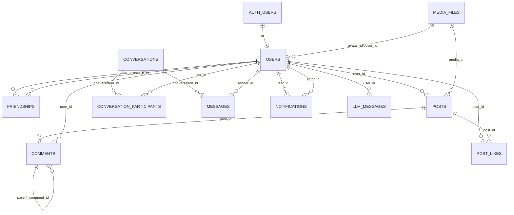

# Database

## Scope
This folder contains the versioned SQL schema for the project, its triggers, and RLS policies used with Supabase/PostgreSQL.

## Files
- `bd/init.sql` - core schema, triggers, and RLS policies.

## Core tables
- `users`
- `friendships`
- `posts`, `post_likes`, `comments`
- `conversations`, `conversation_participants`, `messages`
- `notifications`
- `llm_messages`

## External tables referenced at runtime
- `auth.users` - Supabase Auth identity table. A trigger syncs new users into `public.users`.
- `media_files` - media metadata table used by the file service. Referenced by `users.avatar_id`, `users.cover_id`, and `posts.media_id`.

## Relationships (summary)
- `auth.users.id` 1-1 `users.id` via trigger `handle_new_user`.
- `users.id` 1-N `posts.user_id`, `comments.user_id`, `notifications.user_id`, `messages.sender_id`, `llm_messages.user_id`.
- `users.id` N-N `users.id` via `friendships` (`user_a_id`, `user_b_id`).
- `posts.id` 1-N `comments.post_id` and N-N `users.id` via `post_likes`.
- `comments.id` 1-N `comments.parent_comment_id` for threaded replies.
- `conversations.id` N-N `users.id` via `conversation_participants`.
- `conversations.id` 1-N `messages.conversation_id`.

## Schema diagram

## Triggers and constraints
- `update_timestamp()` keeps `updated_at` current on `users`, `friendships`, and `posts`.
- `handle_new_user()` syncs `auth.users` to `public.users`.
- `friendships` enforces `unique_friendship` and prevents self friendship.
- `llm_messages` enforces a role check for `user` and `assistant`.

## Runtime behavior
- Conversations use `hidden_at` and `last_read_at` for per-user visibility.
- Comment threads are modeled with `parent_comment_id`.
- `media_files` is required by the file service and referenced by user and post media fields.

## Security (RLS)
- All core tables have RLS enabled.
- Policies in `bd/init.sql` define read and write access for users, friendships, posts, chat, notifications, and LLM history.

## Scope notes
- This folder documents the SQL versioned in the repo.
- The live Supabase database can include extra tables or columns not defined here.
